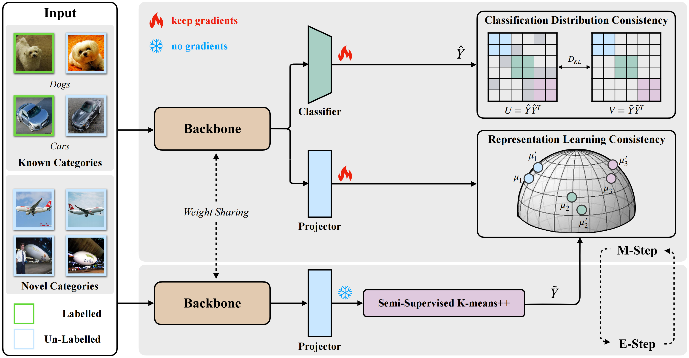
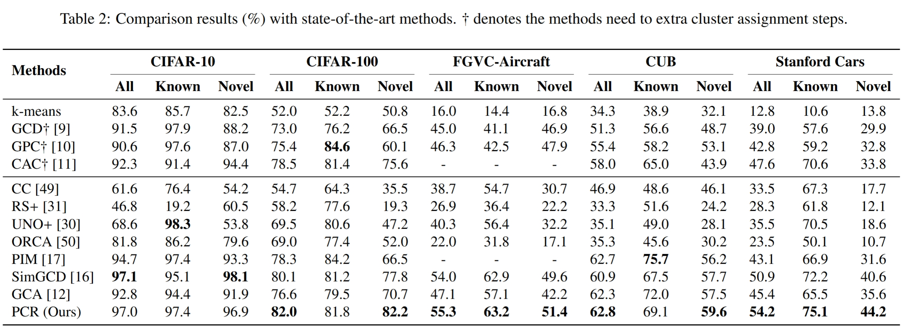

# Prediction consistency regularization for Generalized Category Discovery



Generalized Category Discovery (GCD) is a recently proposed open-world problem that aims to automatically discover and cluster based on partially labeled data. The mainstream GCD methods typically involve two steps: representation learning and classification assignment. Some methods focus on representation and design effective contrastive learning strategies and subsequently utilize clustering methods to obtain the final results. In contrast, some methods attempt to jointly optimize the linear classifier and the model, directly obtaining the predictions. However, the linear classifier is strongly influenced by supervised information, which limits its ability to discover novel categories. In this work, to address the aforementioned issues, we propose the Prediction Consistency Regularization (PCR), which combines the advantages of the aforementioned methods and achieves prediction consistency at both the representation-level and label-level. We employ the Expectation-Maximization (EM) framework to iteratively optimize the model with theoretical guarantees. On one hand, PCR overcomes the limitation of standalone clustering methods that fail to capture fine-grained information within features. On the other hand, it avoids an excessive reliance on supervised information, which can result in the linear classifier getting trapped in local optima. Finally, we comprehensively evaluate our proposed PCR on five benchmark datasets through extensive experiments, and the results demonstrate its superiority over the previous state-of-the-art methods. Our code is available [here](https://github.com/DuannYu/PCR).

## Running

### Dependencies

```
pip install -r requirements.txt
```

### Config

Set paths to datasets and desired log directories in ```config.py```


### Datasets

We use fine-grained benchmarks in this paper, including:

* [CUB-200-2011](http://www.vision.caltech.edu/visipedia-data/CUB-200-2011/CUB_200_2011.tgz)
* Stanford Cars ([Img](http://imagenet.stanford.edu/internal/car196/car_ims.tgz), [Annotation](http://imagenet.stanford.edu/internal/car196/cars_annos.mat))
- [FGVC-Aircraft](https://www.robots.ox.ac.uk/~vgg/data/fgvc-aircraft/)


We use oarse-grained benchmarks in this paper, including:

* [CIFAR-10/100](https://pytorch.org/vision/stable/datasets.html)
* [ImageNet-100](https://image-net.org/download.php)

### Scripts

**Train the model**:

```
bash scripts/run_${DATASET_NAME}.sh
```

If you want to train model by **auto-tuning hyperparamers**, please modify the `scripts/run_${DATASET_NAME}.sh` as follow
```
#!/bin/bash

set -e
set -x

CUDA_VISIBLE_DEVICES=0 python train_auto.py \
    --dataset_name '${DATASET_NAME}' \
    --batch_size 128 \
    --grad_from_block 11 \
    --epochs 200 \
    --num_workers 8 \
    --use_ssb_splits \
    --sup_weight 0.35 \
    --weight_decay 5e-5 \
    --transform 'imagenet' \
    --lr 0.1 \
    --eval_funcs 'v2' \
    --warmup_teacher_temp 0.07 \
    --teacher_temp 0.04 \
    --warmup_teacher_temp_epochs 30 \
    --memax_weight 1 \
    --exp_name ${DATASET_NAME}_pcr 
```
Please refer the [links](https://github.com/microsoft/nni) for more details.

## Experimental Results
Our results on  whole six datasets:


## Acknowledgements

The code repo is largely built on this [repo](https://github.com/sgvaze/generalized-category-discovery).

# Citations
If you use our code, please cite our work as:
```bibtex
@article{duan2024prediction,
  title={Prediction consistency regularization for Generalized Category Discovery},
  author={Duan, Yu and He, Junzhi and Zhang, Runxin and Wang, Rong and Li, Xuelong and Nie, Feiping},
  journal={Information Fusion},
  volume={112},
  pages={102547},
  year={2024},
  publisher={Elsevier}
}
```
